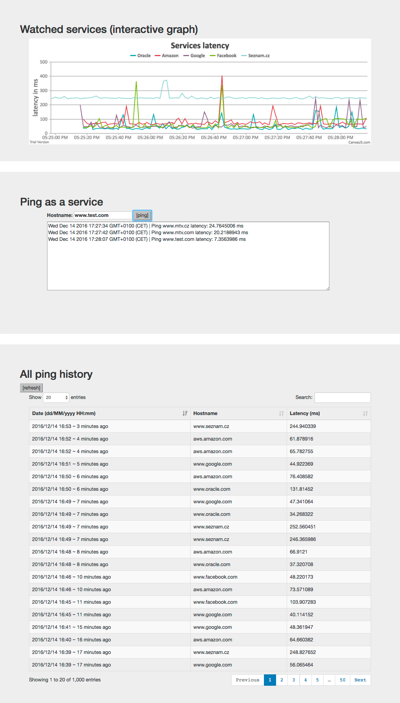

Monitoring service hackathon
============================

The goal of this project is to create simple "ping as a service" on google cloud and using
node.js as a programming language (with cloud provided applications).

Table of contents
-----------------

  * [Table of contents](#table-of-contents)
  * [Service List](#service-list)
    * [ping-service](#ping-service)
    * [ping-listener-service](#ping-listener-service)
    * [ping-scheduler](#ping-scheduler)
    * [monitoring-frontend](#monitoring-frontend)
  * [Build/run HOWTO](#build/run-howto)

Service list
------------

### ping-service

This service is exposes simple REST api, which allows performing http-ping of other service.

Example request:

```
POST /ping
Content-Type: application/json

{
  host: "www.google.com"
  path: "/"
}
```

the service will open a connection to hostname ${entity.host} and performs `HEAD` request.
Response contains same information as the request + information about the performed ping:

```$json
{
  "date":1481730759166,
  "host":"www.google.com",
  "path":"/",
  "status":200,
  "deltaNs":266871627
}
```

When the ping is performed, the service also sends a message using google `PubSub` service to
a topic called `pings` with the same content.

### ping-listener-service

Ping listener listens to topic `pings` and stores all incoming events in google `DataStore`,
into entity called `ping-entity`.

### ping-scheduler

Reads content of google `DataStore`, concretely entity `ping-cron`, where is the list of
continuously monitored services (TODO: make this modifiable - provide CR(UD) API).

Uses `ping-service` for pinging those services.

### monitoring-frontend

The sole public service in this application.

Provides status page, which contains

* interactive graph of pings to monitoring services (uses websocket protocol to get the data)
* ping as a service form
* last 1000 pings in an interactive table

The service provides all APIs necessary for the page to work, so:

* websocket endpoint for continuous stream of ping results
* `POST /ping` for Ping as a Service (proxy to internal `ping-service`)
* `GET /table` for table data

Screenshot of the title page:



Build/run HOWTO
===============

```
cd ${service}
npm install
npm start

docker build -t ${imageName} .
```

make sure you have `GCLOUD_PROJECT` and `GOOGLE_APPLICATION_CREDENTIALS` when running locally.
